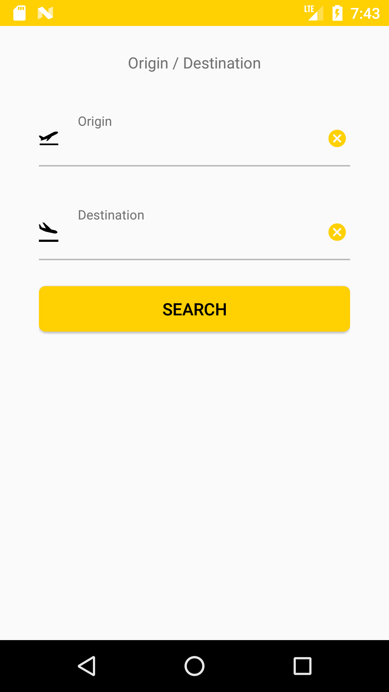
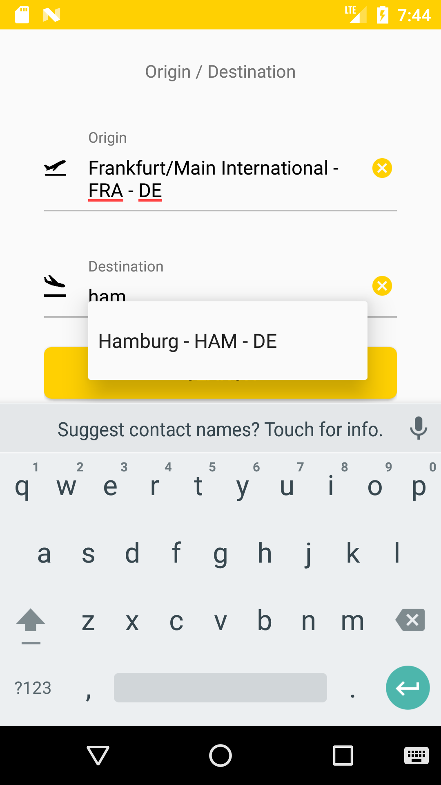
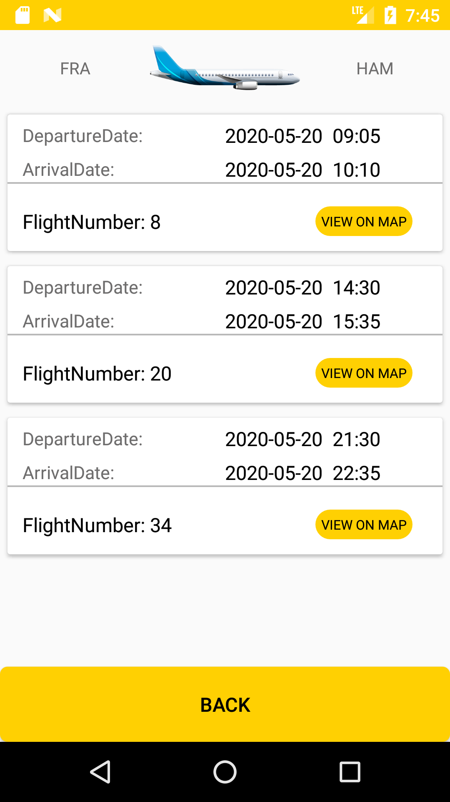
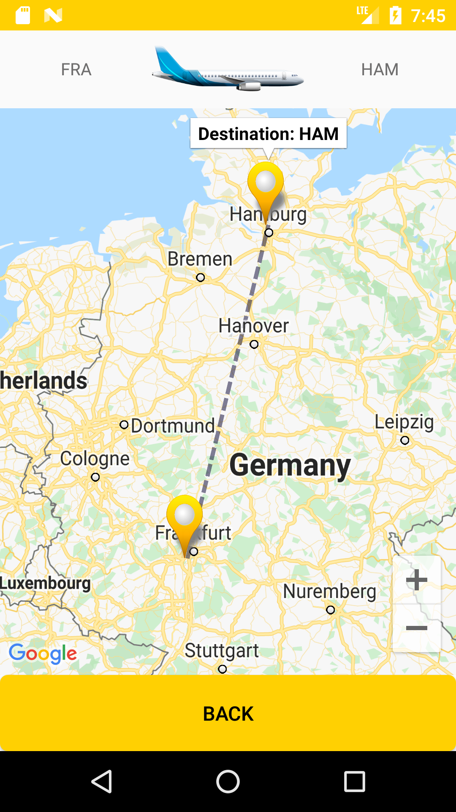

<H1> Flight Schedule </H1>

<B>(Using: Retrofit2 / Butterknife)</B>

This Android app gets list of airline schedules and display their origin and destination airports on a map.

<B>This project implements an Android app with the following features:</B>

 ●	Give option to the user to select the origin and destination airport
 
 ●	Fetch list of airline schedules based on the selections above
 
 ●	Display them on a list
 
 ●	Show the origin and destination of the flight on a map upon selection of a schedule
 
 ●	And connect them with a polyline
 
    
 
 

